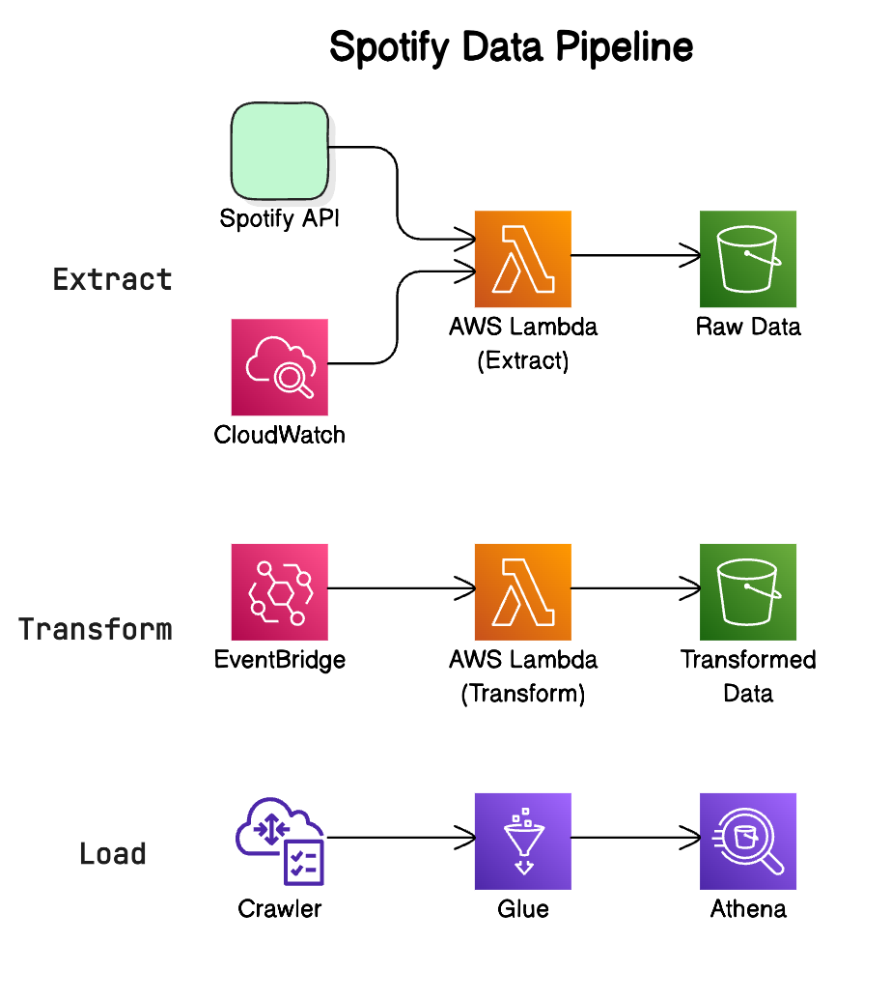

# Spotify Data Pipeline Project

This project implements a data pipeline that extracts data from Spotify's API, transforms it, and loads it into AWS S3 for further analysis. The pipeline is built using Python and various AWS services.

## Table of Contents

- [Overview](#overview)
- [Pipeline Architecture](#pipeline-architecture)
- [Components](#components)
- [Setup](#setup)
- [Usage](#usage)
- [File Structure](#file-structure)
- [Dependencies](#dependencies)

## Overview

This data pipeline project extracts playlist data from Spotify, processes it to separate album, artist, and song information, and then stores the transformed data in AWS S3. The pipeline uses AWS Lambda functions to handle the extraction and transformation processes.

## Pipeline Architecture



## Components

### Data Extraction

AWS Lambda function that uses the Spotify API to fetch playlist data.

### Data Transformation

AWS Lambda function that processes the raw data and transforms it into separate datasets for albums, artists, and songs.

### Data Loading

The transformed data is loaded into specified S3 buckets as CSV files.

## Setup

1. Clone this repository to your local machine.
2. Set up an AWS account if you haven't already.
3. Create an S3 bucket named `spotify-pipeline`.
4. Set up two AWS Lambda functions:
   - One for data extraction (`aws_data_extract_spotify_api.py`)
   - One for data transformation and loading (`aws_spotify_transformation_load.py`)
5. Set up environment variables in your AWS Lambda functions:
   - For the extraction function: `client_id` and `client_secret` (from your Spotify Developer account)
6. Ensure that your Lambda functions have the necessary permissions to access S3.

## Usage

1. The data extraction Lambda function can be triggered on a schedule or manually. It will fetch the latest data from the specified Spotify playlist and store it in the S3 bucket under `raw_data/to_processed/`.
2. The data transformation Lambda function should be set up to trigger when new files are added to the `raw_data/to_processed/` prefix in your S3 bucket. It will process these files and output the results to:
   - `transformed_data/song_data/`
   - `transformed_data/album_data/`
   - `transformed_data/artist_data/`
3. After processing, the raw data files are moved to `raw_data/processed/` for archiving.

## Dependencies

boto3
pandas
spotipy

Ensure these libraries are included in your Lambda function deployment packages.

## File Structure

```plaintext
├── aws_data_extract_spotify_api.py
├── aws_spotify_transformation_load.py
├── spotify_pipeline.ipynb
├── images/
│   └── spotify_pipeline_architecture.png
└── README.md
```
